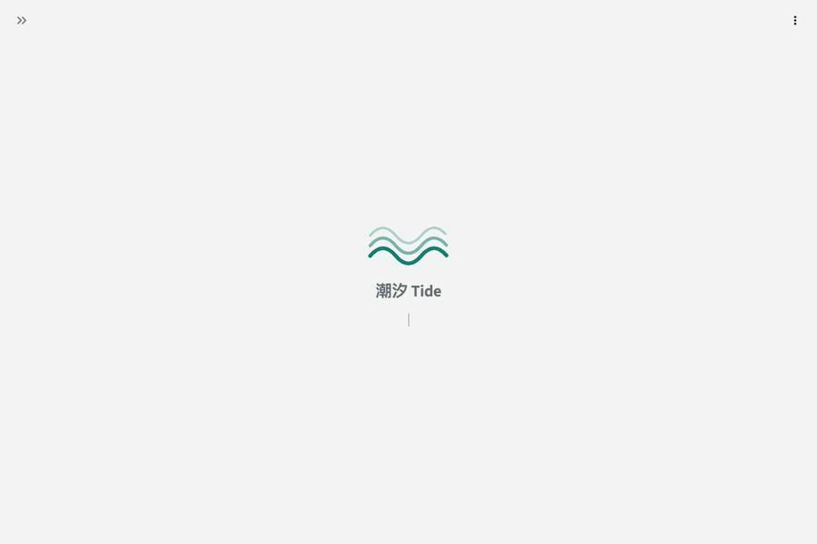
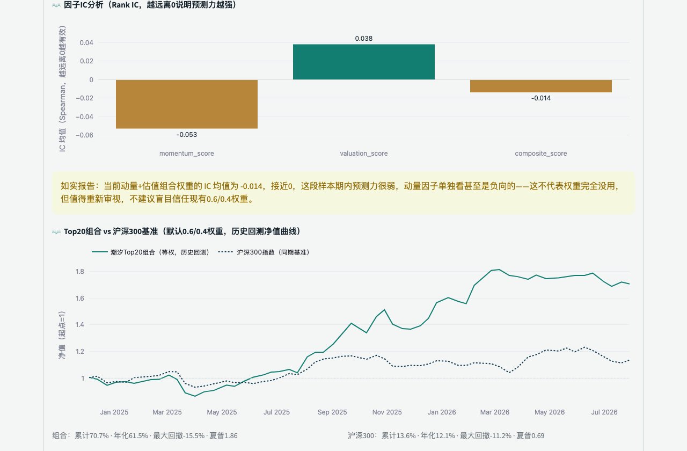
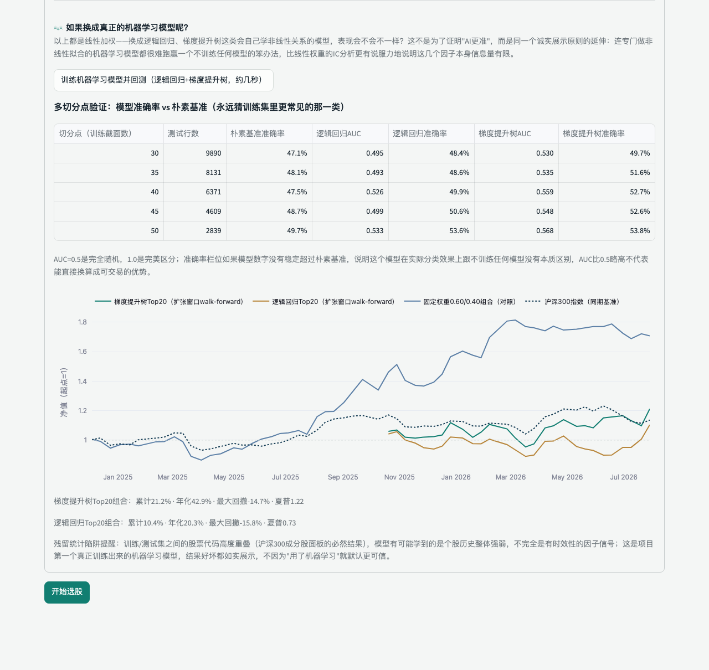
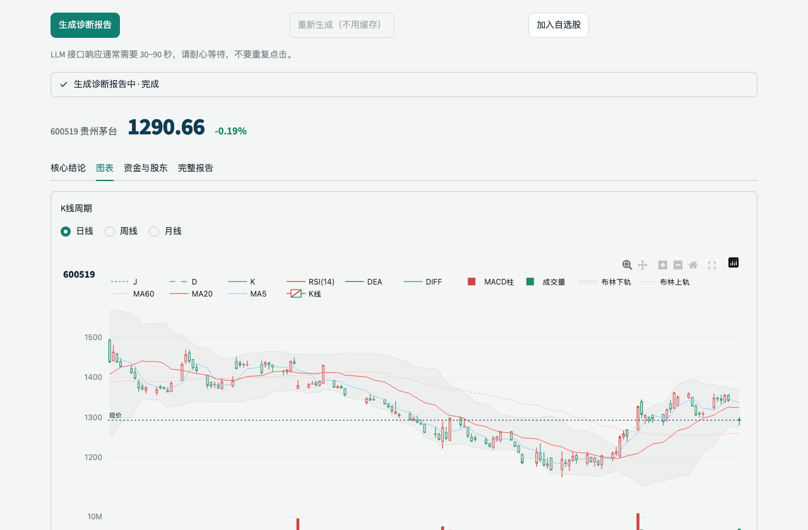
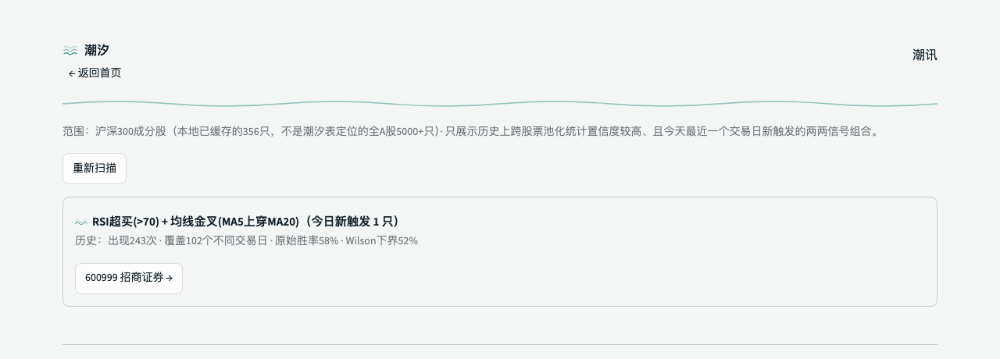

# 潮汐 Tide

**A股为主、联动海外市场的问答式选股助理**

[English](README.md) · 中文

*这是一个展示用仓库——代码是私有的，这个页面介绍项目本身，以及怎么申请体验邀请码。*

---

## 这个项目是怎么来的

我从四年前开始接触股票，这几年有亏有赚，交过不少学费。今年三月，我开始想：与其自己
一个人对着行情软件和K线图瞎琢磨，不如试试用 LLM 帮我分析信息、筛选股票——把重复的
数据整理和技术面梳理交给机器，把判断留给自己。

抱着这个念头，我花了几个月的业余时间，从一个能跑的小脚本，做成了现在这个有完整因子
打分引擎、回测实验室、机器学习对比工具的多页面应用。中间发现自己精心设计的选股权重，
回测下来预测力其实很弱——这个发现没有让我把它藏起来，反而变成了这个项目现在的一条
原则（见下文"诚实"那一节）。

**这不是一个理财产品，也不是荐股工具，是我自己在用、自己在改进的一件个人工具。**

## 想体验一下？

应用已经真实部署上线，目前是邀请制（已经有几位朋友在用），不对外公开开放注册，这个
仓库也刻意没有放代码。

**在这个仓库顶部点“Issues”标签页，开一个新Issue告诉我你想体验一下，附上一个能私下联系到你的方式**
**（邮箱最方便）。** 我会通过那个私下渠道把访问地址和邀请码发给你——不会直接回复在
Issue的公开评论里，因为那样谁都能看到。

## 这是什么

一个跑在服务器上的 Streamlit 应用，四个入口，分别是四种看股票的角度：

| 入口 | 角度 | 做什么 |
|---|---|---|
| **潮汐表** | 涨潮 · 发现 | 全 A 股多因子排行，按动量与估值分位找候选，附入选理由 |
| **验潮** | 满潮 · 深潜 | 对单只股票做深度技术面诊断，K线图 + 历史信号回测统计 |
| **问潮** | 落潮 · 追问 | 针对某只股票的行情、指标与历史信号，多轮追问细节 |
| **潮讯** | 事件驱动 | 今天沪深300里新触发了哪些历史高置信度的信号组合（实验性） |

## 功能亮点

### 潮汐表 · 策略实验室

全 A 股按动量 + 估值多因子打分排行。"策略实验室"里可以自己拖滑块，实时看不同权重
组合历史上的 IC 和回测表现——还能直接训练一个真正的机器学习模型（逻辑回归/梯度提升
树），跟朴素基准诚实地摆在一起对比。

### 验潮 · 单股深度诊断

K线图 + 均线 + MACD/RSI/KDJ，历史信号的胜率统计带 Wilson 置信区间下界（不是裸胜率），
LLM 生成的诊断报告支持再核对一次数字，还有基于因子距离的"相似股票"检索和 LLM 归纳的
近期公告摘要。

### 潮讯 · 事件驱动信号扫描

扫描沪深300成分股，找出今天新触发、且历史上跨股票池化统计置信度较高的两两信号组合。
如果今天没有任何组合达标，页面会如实告诉你"没有"。

### 问潮 · 多轮追问 + 工具调用

针对某只股票的行情、指标、历史信号，用自然语言多轮追问。用 Claude 时，它还能在回答
前自己决定要不要先查一下这只股票的近期公告或相似股票，而不是只能用预先算好的数据
回答。

## 诚实，是这个项目的原则

市面上大多数"AI 选股"工具，营销话术都是"看我们多准"。但我自己交易这几年的经验告诉
我，任何一套简单的因子模型，在短窗口内大概率跑不出显著的预测力，这是常识，不是秘密。

所以潮汐反其道而行之：因子有效性会拿出来给你看，包括"这段时间动量因子的 IC 均值
接近于零、甚至是负的"这种不好看的结论。这条原则对机器学习模型同样适用——我真的在
同一份历史数据上训练过模型，把真实的样本外准确率跟"什么都不学"的朴素基准并列展示。
如实的结果是：梯度提升树勉强比基准高一点点，逻辑回归大多数时候连这个都做不到，两者
都没能稳定跑赢它们本该改进的那个固定权重打分。这个结果就摆在应用里，没有藏起来。

## 技术栈

- **界面**：Python + [Streamlit](https://streamlit.io/)
- **行情数据**：[AkShare](https://akshare.akfamily.xyz/)（东方财富/腾讯财经等公开数据源，多源自动降级）
- **图表**：Plotly
- **机器学习**：scikit-learn（逻辑回归、梯度提升树），扩张窗口walk-forward回测
- **大模型**：Claude / Gemini / GLM 三选一，BYOK
- **部署**：Docker + Caddy，跑在境外小VPS上

## 免责声明

本工具生成的所有内容（包括排行、报告、问答、信号统计）都是数据聚合与历史统计辅助
信息，不构成任何投资建议，不保证数据准确性、完整性或及时性。所有历史回测统计（胜率、
收益、持有周期等）均为历史数据表现，不代表未来收益。股市有风险，投资需自行判断并
承担相应风险。

---

by CSUCRYE

